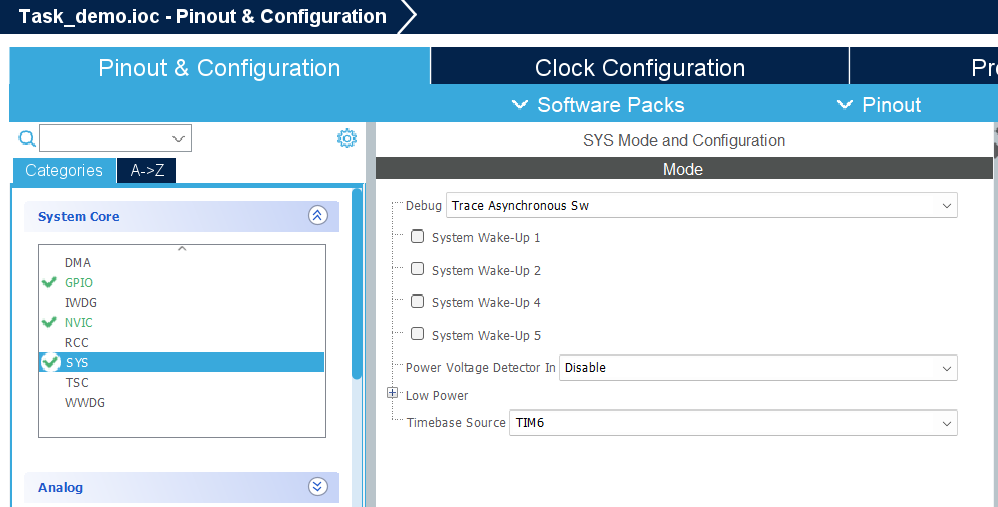
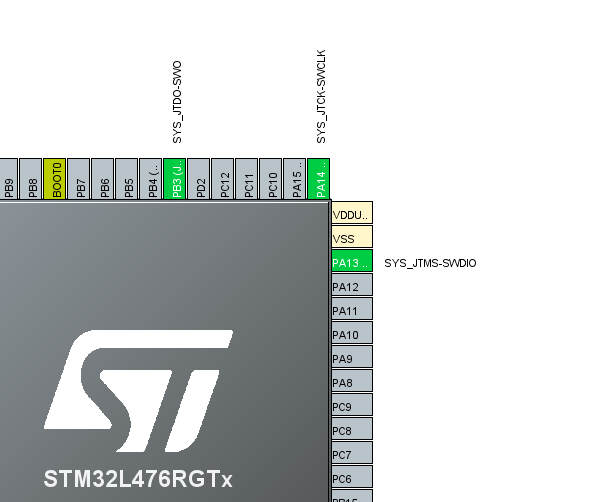

# FreeRTOS Task Demo Steps 
1. Create a New Project 
2. For this project we use "STM32L476RGT6"
3. Configure SysTick to use TIM6    <b> Here are the settings </b>       <b> This is what the IOC will look like </b>      
4. Enable FreeRTOS CMSISv2
5. Add Task 1 and 2
6. Configure the clock
7. Update syscall.c
8. Update Task1 and Task2 Handlers
9. Configure Debug Settings
10. Run Debug -> Resume
11. Watch tasks print to SWV ITM Data Console
