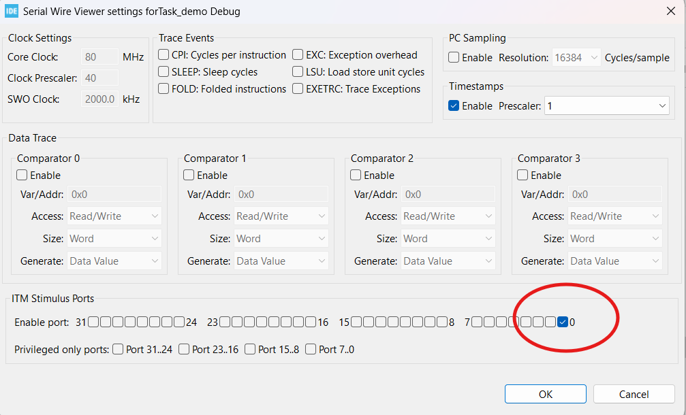

# FreeRTOS Task Demo Steps

### 1. Create a New Project  
### 2. Use Target MCU: `STM32L476RGT6`  
> Configure NEWLIB_REENTRANT

### 3. Configure SysTick to Use TIM6  

  
**TIM6 selected for SysTick configuration**

  
**IOC Configuration Overview**

### 4. Enable FreeRTOS CMSISv2  
### 5. Add Task 1 and Task 2  

  
**RTOS Task Configuration Window**

  
  
**Task 1 and Task 2 Configuration**

### 6. Configure the Clock Tree  
### 7. Update `syscall.c`  

**Paste these lines under the includes section:**  
  
  

**Then update the `__weak__ write()` function to use `TMI_SendChar();`**

### 8. Update Task Handlers in `main.c`  

**Default task handle definitions:**  

**Updated task handle configuration:**  
  

>  Make sure `Task1Handle` and `Task2Handle` are updated in your `main.c`.

### 9. Configure Debug Settings (SWV Enabled)  

### 10. Run Debug → Click "Resume"  

> Configure the trace

> Be sure to use ITM Stimulus port 0

### 11. Observe Output in SWV ITM Data Console 
